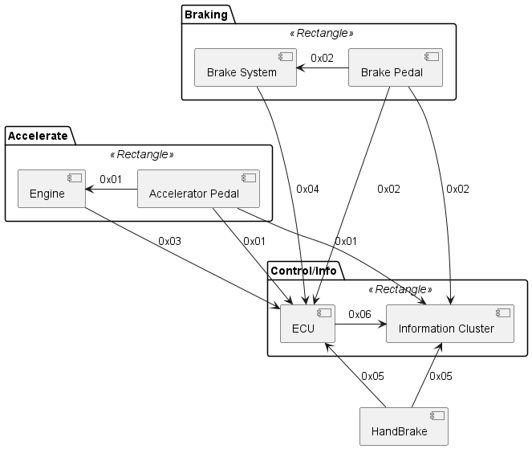

# Build You Own Python Car - BYOPC

You job ~~if you choose to accept it~~ is to build a simulated car in python. For this you will be given a set of requirements and a very basic architecture and a interface control specification.

## Tasks

1. Make groups ~4 person each
2. Read the requirements, study the architecture and the interface specification
3. Install the Virtual Machine
4. Create a plan
5. Implement
6. Test

## Goals

1. Car information cluster
2. Keyboard interface for you car
3. ECU implements the requirements
4. Engine implements the requirements
5. Brake system implements the requirements
6. Interface testing of your car.
7. WLTP class 1 test device for your car. [WLTP info](https://en.wikipedia.org/wiki/Worldwide_Harmonised_Light_Vehicles_Test_Procedure) and [WLTP speed profile](https://unece.org/DAM/trans/doc/2012/wp29grpe/WLTP-DHC-12-07e.xls).
8. WLTP class 3 test device for your car. [WLTP info](https://en.wikipedia.org/wiki/Worldwide_Harmonised_Light_Vehicles_Test_Procedure) and [WLTP speed profile](https://unece.org/DAM/trans/doc/2012/wp29grpe/WLTP-DHC-12-07e.xls).

## Requirements

### REQ-01

The car shall wait 1500kg.

### REQ-02

The car shall have two control pedals, one for acceleration and one for braking.

### REQ-03

The position of the control pedals shall be know every 100ms in a range from 0 (the pedal is not pressed) to 100 (the pedal is fully pressed).

### REQ-04

The car shall have one parking brake.

### REQ-05

The status of the parking brake shall be known every 100ms, the possible values are 0 (brake not active), 1 (brake active).

### REQ-06

The car shall have three operational modes: Parked, Ready and Driving.

### REQ-07

The car shall transition from Parked to Ready when the Parking Brake transitions from active to not active.

### REQ-08

The car shall transition from Ready to Driving when the speed of the vehicle exceeds 10km/h.

### REQ-09

The car shall transition from Driving to Ready when the vehicle speed is 0km/h for more than 30 seconds.

### REQ-10

The car shall transition from Ready to Parked when the Parking brake transitions from not active to active.

### REQ-11

Not defined transitions are not allowed.

### REQ-12

The car engine shall produce the maximum acceleration of 5 m/s2 at 8000rpm.

### REQ-13

The car engine produced acceleration shall be vary linearly with the accelerator pedal position.

### REQ-14

The car brake system shall produce a maximum deceleration of 6 m/s2.

### REQ-15

The car brake system produced deceleration shall be vary linearly with the brake pedal position.

### REQ-16

The car engine shall report the currently produced acceleration level every 50ms.

### REQ-17

The car brake system shall report the currently produced deceleration level every 50ms.

### REQ-18

The ECU shall calculate the car current speed.

### REQ-19

The ECU shall communicate the current speed every 50ms to the information cluster.

### REQ-20

The car information cluster shall display the current speed, current car operational mode, current accelerator pedal position and current brake pedal position.

### REQ-21

The car speed shall be limited to 250km/h.

### REQ-22

All the communication between ECUs shall be done using the CAN protocol at a baud rate of 500 kbps.

### REQ-23

The Parking Brake system shall only transition from active to not active in the Parked mode.

### REQ-24

The Parking Brake system shall only transition from not active to active in the Ready mode.

## Interface Specification

### Accelerator pedal position

- ID - 0x01
- Fields:
  - Position - Integer - 0<->100

### Brake pedal position

- ID - 0x02
- Fields:
  - Position - Integer - 0<->100

### Engine message

- ID - 0x03
- Fields:
  - Acceleration - Floating Point - 0<->5

### Brake System message

- ID - 0x04
- Fields:
  - Acceleration - Floating Point - -6<->0

### Parking Brake status

- ID - 0x05
- Fields:
  - Status - Boolean - ON<->OFF

### Car status message

- ID - 0x06
- Fields:
  - Speed - Floating Point - 0<->250
  - Operational Mode - Array - [Parked, Ready and Driving]

## Architecture

## Tips

- Use:
  - [python-can](https://python-can.readthedocs.io/en/master/) for the messages
  - [kivy](https://kivy.org/#home) for the GUI
  - [speedmeter](https://github.com/kivy-garden/speedmeter) for the GUI elements. See the examples.
- Use the VM provided [here](https://criticalsoftwaresa-my.sharepoint.com/:u:/r/personal/jr-simoes_criticalsoftware_com/Documents/Summer%20Camp%202022/sc-xubuntu.zip?csf=1&web=1&e=hnQUCf)
  - Username: sc
  - Password: sc
