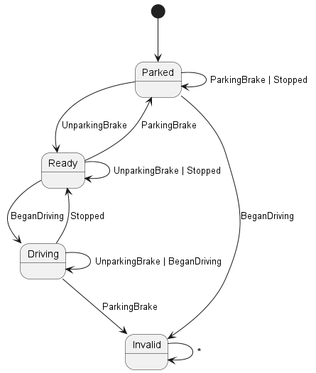

# Carro Simulator

A project developed by me and some friends during our summer internship at
Critical Software.

## Demo

## Purpose

Build a simulated car in _Python_. For this, you will be given a set of
requirements and a very basic architecture and an interface control
specification

### Goals

1. Car information cluster
2. Keyboard interface for you car
3. ECU implements the requirements
4. Engine implements the requirements
5. Brake system implements the requirements
6. Interface testing of your car.
7. WLTP class 1 test device for your car.
   [WLTP info](https://en.wikipedia.org/wiki/Worldwide_Harmonised_Light_Vehicles_Test_Procedure)
   and
   [WLTP speed profile](https://unece.org/DAM/trans/doc/2012/wp29grpe/WLTP-DHC-12-07e.xls).
8. WLTP class 3 test device for your car.
   [WLTP info](https://en.wikipedia.org/wiki/Worldwide_Harmonised_Light_Vehicles_Test_Procedure)
   and
   [WLTP speed profile](https://unece.org/DAM/trans/doc/2012/wp29grpe/WLTP-DHC-12-07e.xls).

### Requirements and CAN-bus message specification

The requirements can be found on the [BYOPC file](./BYOPC.md).

## Usage

Run the following python scripts:

- [guiController.py](./src/guiController.py) -- Run the GUI;
- [simulator.py](./src/simulator.py) -- Run the simulator;
- [wltpTests.py](./src/wltpTests.py) -- Run class 1 and 3 WLTP tests.

## Tech Stack

- [Python](https://www.python.org/) for the ECU (Electronic Control Unit)
- [Python-can](https://python-can.readthedocs.io/en/master/) for the messages
- [Kivy](https://kivy.org/#home) for the GUI
- [Kivy-garden speedmeter](https://github.com/kivy-garden/speedmeter) for the
  GUI elements. See the examples.

This is run in a Linux VM environment (Xubuntu). All dependencies can be
installed through **pip** using the [requirements.txt](./requirements.txt) file.

## Credits

- [Screaming Neon font](https://www.1001fonts.com/screaming-neon-font.html) --
  used on the UI.

## Authors

- [João Costa](https://github.com/JoaoCostaIFG)
- [João Gil](https://github.com/monkin77)
- [José Macedo](TODO)
- [Tiago Silva](https://github.com/tiagodusilva)
